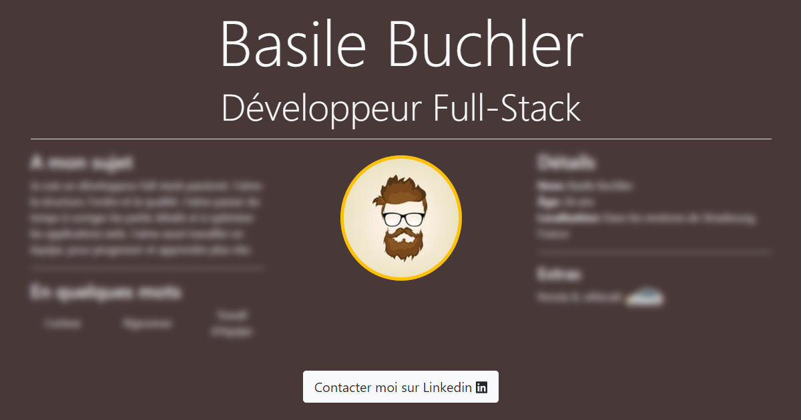

# My resume

_This project is my resume as a Single Page website._

    

        
    

## Global information

You can use a distant database to complete your resume with a [GraphQL](https://graphql.org/) query or set your resume in a [TypeScript](https://www.typescriptlang.org/) class. 
The class will be used in case of failure while reaching the database. The internalization is configured with [i18next](https://www.i18next.com/).

### Available Scripts

This project was bootstrapped with [Create React App](https://github.com/facebook/create-react-app).
In the project directory, you can run:

- `npm start`: Runs the app in the development mode. Open http://localhost:3000 to view it in the browser.
- `npm test`: Launches the test runner in the interactive watch mode.
- `npm run build`: Builds the app for production to the `build` folder.
- `npm run eject`: See [npm run eject](https://create-react-app.dev/docs/available-scripts/#npm-run-eject)

_You can learn more in the [Create React App documentation](https://facebook.github.io/create-react-app/docs/getting-started)._
